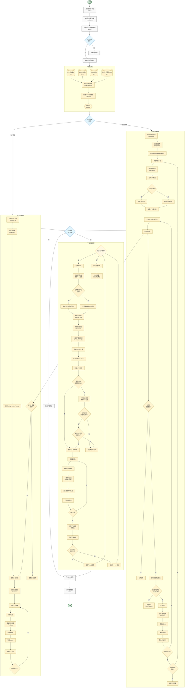

```mermaid
flowchart TD
    %% 样式定义
    classDef process fill:#f9f9f9,stroke:#333,stroke-width:1px
    classDef decision fill:#e1f5fe,stroke:#01579b,stroke-width:1px
    classDef startEnd fill:#d4edda,stroke:#155724,stroke-width:2px
    classDef module fill:#fff3cd,stroke:#856404,stroke-width:1px
    classDef subflow fill:#f3e5f5,stroke:#4a148c,stroke-width:1px
    
    %% 主流程
    A([开始]) --> B[解析命令行参数<br>args.rs]
    B --> B1[处理网络接口参数<br>interface.rs]
    B1 --> C[初始化全局并发限制器<br>pool.rs]
    C --> D{设置全局<br>超时?}
    D -->|是| E[创建超时线程]
    D -->|否| F[初始化随机数种子]
    E --> F
    
    %% IP处理子图
    subgraph IP处理流程
        direction TB
        classDef subflow fill:#e8f5e9,stroke:#2e7d32,stroke-width:1px
        
        J1[(从文件加载IP<br>ip.rs)] --> J5
        J2[(从文本加载IP<br>ip.rs)] --> J5
        J3[(从URL加载IP<br>ip.rs)] --> J5
        J4[(解析IP范围和CIDR<br>ip.rs)] --> J5
        J5[创建无锁IP链表<br>LockFreeIpList] --> J6
        J6[创建CIDR状态管理<br>CidrState] --> J7{{IP缓冲区<br>IpBuffer}}
        
        class J1,J2,J3,J4,J5,J6,J7 subflow
    end
    
    F --> IP处理流程
    
    IP处理流程 --> G{选择测速<br>模式}
    G -->|HTTP测速| HTTP测速流程
    G -->|TCP测速| TCP测速流程
    
    %% HTTP测速子图
    subgraph HTTP测速流程
        direction TB
        classDef subflow fill:#e3f2fd,stroke:#1565c0,stroke-width:1px
        
        H1[初始化测试环境<br>common.rs] --> H2
        H2[创建进度条<br>progress.rs] --> H3
        H3[创建HttpingHandlerFactory] --> H4
        H4[获取并发许可] --> H5
        H5[绑定网络接口<br>interface.rs] --> H6
        H6[选择URL模式] --> H7{HTTPS模式?}
        H7 -->|是| H8[轮询URL列表]
        H7 -->|否| H9[使用IP构建URL]
        H8 --> H10[构建HTTP客户端]
        H9 --> H10
        H10 --> H11[发送HTTP HEAD请求]
        H11 --> H12[检查状态码]
        H12 --> H13{状态码<br>符合要求?}
        H13 -->|否| H14[丢弃结果]
        H13 -->|是| H15[提取数据中心信息]
        H15 --> H16{数据中心符合<br>过滤条件?}
        H16 -->|否| H17[终止测试<br>跳过后续ping]
        H16 -->|是| H18[计算延迟]
        H18 --> H19[更新测试结果<br>PingData]
        H19 --> H20[更新进度条]
        H20 --> H21[等待200ms]
        H21 --> H22[释放并发许可]
        H22 --> H23{还有ping次数?}
        H23 -->|是| H11
        H23 -->|否| H24{还有IP需要<br>测试?}
        H24 -->|是| H4
        H24 -->|否| H25[收集测试结果]
        
        class H1,H2,H3,H4,H5,H6,H7,H8,H9,H10,H11,H12,H13,H14,H15,H16,H17,H18,H19,H20,H21,H22,H23,H24,H25 subflow
    end
    
    %% TCP测速子图
    subgraph TCP测速流程
        direction TB
        classDef subflow fill:#fff3e0,stroke:#e65100,stroke-width:1px
        
        T1[初始化测试环境<br>common.rs] --> T2
        T2[创建进度条<br>progress.rs] --> T3
        T3[创建TcpingHandlerFactory] --> T4
        T4[获取并发许可] --> T5
        T5[绑定网络接口<br>interface.rs] --> T6
        T6[创建TCP连接] --> T7
        T7[计算延迟] --> T8
        T8[更新测试结果<br>PingData] --> T9
        T9[更新进度条] --> T10
        T10[等待300ms] --> T11
        T11[释放并发许可] --> T12{还有ping次数?}
        T12 -->|是| T6
        H12 -->|否| T13{还有IP需要<br>测试?}
        T13 -->|是| T4
        T13 -->|否| T14[收集测试结果]
        
        class T1,T2,T3,T4,T5,T6,T7,T8,T9,T10,T11,T12,T13,T14 subflow
    end
    
    HTTP测速流程 --> L{是否禁用<br>下载测速?}
    TCP测速流程 --> L
    
    L -->|是| M[跳过下载测速]
    L -->|否| 下载测速流程
    
    %% 修正后的下载测速流程
    subgraph 下载测速流程
        direction TB
        classDef subflow fill:#fff8e1,stroke:#f57c00,stroke-width:1px
        
        N0{是否有IP要测?} -->|是| N1[选择测试IP]
        N0 -->|否| N29[筛选合格结果]
        N1 --> N2
        N2[检查是否已有<br>数据中心信息] --> N3{已有数据中心<br>信息?}
        N3 -->|是| N4[使用已有数据中心信息]
        N3 -->|否| N5[需要获取数据中心信息]
        N4 --> N6[选择测试URL<br>轮询URL列表]
        N5 --> N6
        N6 --> N7[绑定网络接口<br>interface.rs]
        N7 --> N8[创建下载处理器<br>DownloadHandler]
        N8 --> N9[构建HTTP客户端]
        N9 --> N10[发送HTTP GET请求]
        N10 --> N11[获取HTTP响应]
        N11 --> N12{需要获取<br>数据中心信息?}
        N12 -->|否| N13[直接进入下载流程]
        N12 -->|是| N14[从响应头提取<br>数据中心信息]
        N14 --> N15{成功提取<br>数据中心信息?}
        N15 -->|否| N16[返回不合格结果]
        N15 -->|是| N17{数据中心符合<br>过滤条件?}
        N17 -->|否| N16
        N17 -->|是| N13
        
        %% 下载循环现在在正确的位置
        N13 --> N18[读取数据块]
        N18 --> N19[更新接收数据量]
        N19 --> N20[计算实时速度<br>滑动窗口采样]
        N20 --> N21[更新速度样本队列]
        N21 --> N22[更新进度显示]
        N22 --> N23{下载完成?}
        N23 -->|否| N18
        N23 -->|是| N24[计算平均速度<br>预热后]
        
        N24 --> N25[更新下载速度]
        N25 --> N26{速度符合<br>阈值要求?}
        N26 -->|否| N27[返回不合格结果]
        N26 -->|是| N28[继续下一个IP测试]
        N27 --> N0
        N28 --> N0
        N29 --> N30[排序结果<br>综合评分算法]
        
        class N0,N1,N2,N3,N4,N5,N6,N7,N8,N9,N10,N11,N12,N13,N14,N15,N16,N17,N18,N19,N20,N21,N22,N23,N24,N25,N26,N27,N28,N29,N30 subflow
    end
    
    M & 下载测速流程 --> O[导出CSV结果<br>csv.rs]
    O --> P[打印结果表格<br>csv.rs]
    P --> Q([结束])
    
    %% 应用样式
    class A,Q startEnd
    class B,B1,C,E,F,M,O,P process
    class D,G,L decision
    class H1,H2,H3,H4,H5,H6,H7,H8,H9,H10,H11,H12,H13,H14,H15,H16,H17,H18,H19,H20,H21,H22,H23,H24,H25,T1,T2,T3,T4,T5,T6,T7,T8,T9,T10,T11,T12,T13,T14,J1,J2,J3,J4,J5,J6,J7,N1,N2,N3,N4,N5,N6,N7,N8,N9,N10,N11,N12,N13,N14,N15,N16,N17,N18,N19,N20,N21,N22,N23,N24,N25,N26,N27,N28,N29,N30 module
```
