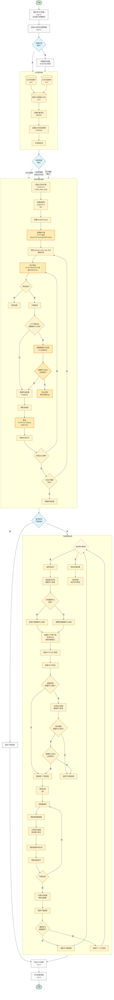

```mermaid
flowchart TD
    %% 样式定义
    classDef process fill:#f9f9f9,stroke:#333,stroke-width:1px
    classDef decision fill:#e1f5fe,stroke:#01579b,stroke-width:1px
    classDef startEnd fill:#d4edda,stroke:#155724,stroke-width:2px
    classDef module fill:#fff3cd,stroke:#856404,stroke-width:1px
    classDef subflow fill:#f3e5f5,stroke:#4a148c,stroke-width:1px
    classDef diff fill:#ffecb3,stroke:#ff6f00,stroke-width:2px
    
    %% 主流程
    A([开始]) --> B[解析命令行参数<br>args.rs<br>包含接口参数解析]
    B --> C[初始化全局并发限制器<br>pool.rs]
    C --> D{设置全局<br>超时?}
    D -->|是| E[创建超时线程<br>AtomicBool标志]
    D -->|否| IP处理流程
    E --> IP处理流程
    
    %% IP处理子图
    subgraph IP处理流程
        direction TB
        classDef subflow fill:#e8f5e9,stroke:#2e7d32,stroke-width:1px
        
        J1[(从文件加载IP<br>ip.rs)] --> J4
        J2[(从文本加载IP<br>ip.rs)] --> J4
        J4[(解析IP范围和CIDR<br>ip.rs)] --> J5
        J5[创建IP缓冲区<br>IpBuffer] --> J6
        J6[创建CIDR状态管理<br>CidrState] --> J7[IP处理完成]
        
        class J1,J2,J4,J5,J6,J7 subflow
    end
    
    IP处理流程 --> G{选择测速<br>模式}
    G -->|HTTP测速| 延迟测速流程
    G -->|ICMP测速<br>feature=icmp| 延迟测速流程
    G -->|TCP测速<br>默认| 延迟测速流程
    
    %% 延迟测速子图（合并三种模式）
    subgraph 延迟测速流程
        direction TB
        classDef subflow fill:#e3f2fd,stroke:#1565c0,stroke-width:1px
        
        P1[初始化测试环境<br>common.rs<br>create_base_ping] --> P2
        P2[创建进度条<br>progress.rs<br>Bar] --> P3
        P3[创建HandlerFactory] --> P4
        P4[创建客户端<br>HTTP:全局Client/TCP:Socket/ICMP:Client] --> P5
        P5[通过execute_with_rate_limit<br>控制并发] --> P6
        P6[执行测试<br>HTTP:HEAD/TCP:连接/ICMP:Echo] --> P7
        P7{测试成功?} -->|否| P8[丢弃结果]
        P7 -->|是| P9[计算延迟]
        P9 --> P10{HTTP模式且<br>需数据中心过滤?}
        P10 -->|是| P11[提取数据中心信息<br>cf-ray响应头]
        P10 -->|否| P12[更新测试结果<br>PingData]
        P11 --> P13{数据中心符合<br>过滤条件?}
        P13 -->|否| P14[终止测试<br>跳过后续ping]
        P13 -->|是| P12
        P12 --> P15[更新进度条]
        P15 --> P16[等待<br>HTTP/TCP:200ms<br>ICMP:0ms]
        P16 --> P17[释放并发许可]
        P17 --> P18{还有ping次数?}
        P18 -->|是| P6
        P18 -->|否| P19{还有IP需要<br>测试?}
        P19 -->|是| P5
        P19 -->|否| P20[收集测试结果]
        
        class P1,P2,P3,P4,P5,P6,P7,P8,P9,P10,P11,P12,P13,P14,P15,P16,P17,P18,P19,P20 subflow
        class P4,P6,P10,P11,P13,P14,P16 diff
    end
    
    延迟测速流程 --> L{是否禁用<br>下载测速?}
    
    L -->|是| M[跳过下载测速]
    L -->|否| 下载测速流程
    
    subgraph 下载测速流程
        direction TB
        classDef subflow fill:#fff8e1,stroke:#f57c00,stroke-width:1px
        
        N0{是否有IP要测?} -->|是| N1[选择测试IP]
        N0 -->|否| N29[筛选合格结果]
        N1 --> N2
        N2[检查是否已有<br>数据中心信息] --> N3{已有数据中心<br>信息?}
        N3 -->|是| N4[使用已有数据中心信息]
        N3 -->|否| N5[需要获取数据中心信息]
        N4 --> N6[构建HTTP客户端<br>复用Client<br>绑定网络接口]
        N5 --> N6
        N6 --> N7[发送HTTP GET请求]
        N7 --> N8[获取HTTP响应]
        N8 --> N9{需要获取<br>数据中心信息?}
        N9 -->|否| N10[直接进入下载流程]
        N9 -->|是| N11[从响应头提取<br>数据中心信息]
        N11 --> N12{成功提取<br>数据中心信息?}
        N12 -->|否| N13[返回不合格结果]
        N12 -->|是| N14{数据中心符合<br>过滤条件?}
        N14 -->|否| N13
        N14 -->|是| N10
        
        N10 --> N15[预热阶段<br>3秒]
        N15 --> N16[读取数据块]
        N16 --> N17[更新接收数据量]
        N17 --> N18[计算实时速度<br>滑动窗口采样]
        N18 --> N19[更新速度样本队列]
        N19 --> N20[更新进度显示]
        N20 --> N21{下载完成?}
        N21 -->|否| N16
        N21 -->|是| N22[计算平均速度<br>预热后数据]
        
        N22 --> N23[更新下载速度]
        N23 --> N24{速度符合<br>阈值要求?}
        N24 -->|否| N25[返回不合格结果]
        N24 -->|是| N26[继续下一个IP测试]
        N25 --> N0
        N26 --> N0
        N29 --> N30[排序结果<br>综合评分算法]
        
        class N0,N1,N2,N3,N4,N5,N6,N7,N8,N9,N10,N11,N12,N13,N14,N15,N16,N17,N18,N19,N20,N21,N22,N23,N24,N25,N26,N29,N30 subflow
    end
    
    M & 下载测速流程 --> O[导出CSV结果<br>csv.rs]
    O --> P[打印结果表格<br>csv.rs]
    P --> Q([结束])
    
    %% 应用样式
    class A,Q startEnd
    class B,C,E,M,O,P process
    class D,G,L decision
    class P1,P2,P3,P5,P7,P8,P9,P10,P12,P15,P17,P18,P19,P20,J1,J2,J4,J5,J6,J7,N1,N2,N3,N4,N5,N6,N7,N8,N9,N10,N11,N12,N13,N14,N15,N16,N17,N18,N19,N20,N21,N22,N23,N24,N25,N26,N29,N30 module
```
