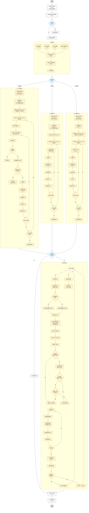

```mermaid
flowchart TD
    %% 样式定义
    classDef process fill:#f9f9f9,stroke:#333,stroke-width:1px
    classDef decision fill:#e1f5fe,stroke:#01579b,stroke-width:1px
    classDef startEnd fill:#d4edda,stroke:#155724,stroke-width:2px
    classDef module fill:#fff3cd,stroke:#856404,stroke-width:1px
    classDef subflow fill:#f3e5f5,stroke:#4a148c,stroke-width:1px
    
    %% 主流程
    A([开始]) --> B[解析命令行参数<br>args.rs<br>包含接口参数解析]
    B --> C[初始化全局并发限制器<br>pool.rs]
    C --> D{设置全局<br>超时?}
    D -->|是| E[创建超时线程]
    D -->|否| F[初始化随机数种子]
    E --> F
    
    %% IP处理子图
    subgraph IP处理流程
        direction TB
        classDef subflow fill:#e8f5e9,stroke:#2e7d32,stroke-width:1px
        
        J1[(从文件加载IP<br>ip.rs)] --> J5
        J2[(从文本加载IP<br>ip.rs)] --> J5
        J3[(从URL加载IP<br>ip.rs)] --> J5
        J4[(解析IP范围和CIDR<br>ip.rs)] --> J5
        J5[创建IP缓冲区<br>IpBuffer] --> J6
        J6[创建CIDR状态管理<br>CidrState] --> J7[IP处理完成]
        
        class J1,J2,J3,J4,J5,J6,J7 subflow
    end
    
    F --> IP处理流程
    
    IP处理流程 --> G{选择测速<br>模式}
    G -->|HTTP测速| HTTP测速流程
    G -->|TCP测速| TCP测速流程
    G -->|ICMP测速| ICMP测速流程
    
    %% HTTP测速子图
    subgraph HTTP测速流程
        direction TB
        classDef subflow fill:#e3f2fd,stroke:#1565c0,stroke-width:1px
        
        H1[初始化测试环境<br>common.rs<br>创建Ping结构体] --> H2
        H2[创建进度条<br>progress.rs<br>原子计数器异步更新] --> H3
        H3[创建HttpingHandlerFactory<br>创建全局HTTP客户端] --> H4
        H4[通过execute_with_rate_limit<br>控制并发] --> H5
        H5[使用IP构建URL] --> H9
        H9[发送HTTP HEAD请求<br>复用全局客户端] --> H11
        H11[检查状态码] --> H12{状态码<br>符合要求?}
        H12 -->|否| H13[丢弃结果]
        H12 -->|是| H14[提取数据中心信息]
        H14 --> H15{数据中心符合<br>过滤条件?}
        H15 -->|否| H16[终止测试<br>跳过后续ping]
        H15 -->|是| H17[计算延迟]
        H17 --> H18[更新测试结果<br>PingData]
        H18 --> H19[更新进度条]
        H19 --> H20[等待200ms]
        H20 --> H21[释放并发许可]
        H21 --> H22{还有ping次数?}
        H22 -->|是| H9
        H22 -->|否| H23{还有IP需要<br>测试?}
        H23 -->|是| H4
        H23 -->|否| H24[收集测试结果]
        
        class H1,H2,H3,H4,H5,H9,H11,H12,H13,H14,H15,H16,H17,H18,H19,H20,H21,H22,H23,H24 subflow
    end
    
    %% TCP测速子图
    subgraph TCP测速流程
        direction TB
        classDef subflow fill:#fff3e0,stroke:#e65100,stroke-width:1px
        
        T1[初始化测试环境<br>common.rs<br>创建Ping结构体] --> T2
        T2[创建进度条<br>progress.rs<br>原子计数器异步更新] --> T3
        T3[创建TcpingHandlerFactory] --> T4
        T4[通过execute_with_rate_limit<br>控制并发] --> T5
        T5[创建TCP连接<br>绑定网络接口] --> T6
        T6[计算延迟] --> T7
        T7[更新测试结果<br>PingData] --> T8
        T8[更新进度条] --> T9
        T9[等待200ms] --> T10
        T10[释放并发许可] --> T11{还有ping次数?}
        T11 -->|是| T5
        T11 -->|否| T12{还有IP需要<br>测试?}
        T12 -->|是| T4
        T12 -->|否| T13[收集测试结果]
        
        class T1,T2,T3,T4,T5,T6,T7,T8,T9,T10,T11,T12,T13 subflow
    end

    %% ICMP测速子图
    subgraph ICMP测速流程
        direction TB
        classDef subflow fill:#fce4ec,stroke:#880e4f,stroke-width:1px
        
        I1[初始化测试环境<br>common.rs<br>创建Ping结构体] --> I2
        I2[创建进度条<br>progress.rs] --> I3
        I3[创建IcmpingHandlerFactory<br>创建surge_ping客户端] --> I4
        I4[通过execute_with_rate_limit<br>控制并发] --> I5
        I5[发送ICMP Ping<br>surge_ping] --> I6
        I6[计算延迟] --> I7
        I7[更新测试结果<br>PingData] --> I8
        I8[更新进度条] --> I9
        I9[等待0ms] --> I10
        I10[释放并发许可] --> I11{还有ping次数?}
        I11 -->|是| I5
        I11 -->|否| I12{还有IP需要<br>测试?}
        I12 -->|是| I4
        I12 -->|否| I13[收集测试结果]

        class I1,I2,I3,I4,I5,I6,I7,I8,I9,I10,I11,I12,I13 subflow
    end
    
    HTTP测速流程 --> L{是否禁用<br>下载测速?}
    TCP测速流程 --> L
    ICMP测速流程 --> L
    
    L -->|是| M[跳过下载测速]
    L -->|否| 下载测速流程
    
    subgraph 下载测速流程
        direction TB
        classDef subflow fill:#fff8e1,stroke:#f57c00,stroke-width:1px
        
        N0{是否有IP要测?} -->|是| N1[选择测试IP]
        N0 -->|否| N29[筛选合格结果]
        N1 --> N2
        N2[检查是否已有<br>数据中心信息] --> N3{已有数据中心<br>信息?}
        N3 -->|是| N4[使用已有数据中心信息]
        N3 -->|否| N5[需要获取数据中心信息]
        N4 --> N6[准备测试URL]
        N5 --> N6
        N6 --> N7[创建下载处理器<br>DownloadHandler<br>绑定网络接口]
        N7 --> N8[构建HTTP客户端]
        N8 --> N9[发送HTTP GET请求]
        N9 --> N10[获取HTTP响应]
        N10 --> N11{需要获取<br>数据中心信息?}
        N11 -->|否| N12[直接进入下载流程]
        N11 -->|是| N13[从响应头提取<br>数据中心信息]
        N13 --> N14{成功提取<br>数据中心信息?}
        N14 -->|否| N15[返回不合格结果]
        N14 -->|是| N16{数据中心符合<br>过滤条件?}
        N16 -->|否| N15
        N16 -->|是| N12
        
        N12 --> N17[读取数据块]
        N17 --> N18[更新接收数据量]
        N18 --> N19[计算实时速度<br>滑动窗口采样]
        N19 --> N20[更新速度样本队列]
        N20 --> N21[更新进度显示]
        N21 --> N22{下载完成?}
        N22 -->|否| N17
        N22 -->|是| N23[计算平均速度<br>预热后]
        
        N23 --> N24[更新下载速度]
        N24 --> N25{速度符合<br>阈值要求?}
        N25 -->|否| N26[返回不合格结果]
        N25 -->|是| N27[继续下一个IP测试]
        N26 --> N0
        N27 --> N0
        N29 --> N30[排序结果<br>综合评分算法]
        
        class N0,N1,N2,N3,N4,N5,N6,N7,N8,N9,N10,N11,N12,N13,N14,N15,N16,N17,N18,N19,N20,N21,N22,N23,N24,N25,N26,N27,N28,N29,N30 subflow
    end
    
    M & 下载测速流程 --> O[导出CSV结果<br>csv.rs]
    O --> P[打印结果表格<br>csv.rs]
    P --> Q([结束])
    
    %% 应用样式
    class A,Q startEnd
    class B,B1,C,E,F,M,O,P process
    class D,G,L decision
    class H1,H2,H3,H4,H5,H9,H11,H12,H13,H14,H15,H16,H17,H18,H19,H20,H21,H22,H23,H24,H25,T1,T2,T3,T4,T5,T6,T7,T8,T9,T10,T11,T12,T13,T14,J1,J2,J3,J4,J5,J6,J7,N1,N2,N3,N4,N5,N6,N7,N8,N9,N10,N11,N12,N13,N14,N15,N16,N17,N18,N19,N20,N21,N22,N23,N24,N25,N26,N27,N28,N29,N30,I1,I2,I3,I4,I5,I6,I7,I8,I9,I10,I11,I12,I13 module
```
