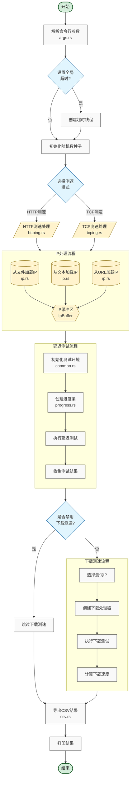

```mermaid
flowchart TD
    %% 样式定义
    classDef process fill:#f9f9f9,stroke:#333,stroke-width:1px
    classDef decision fill:#e1f5fe,stroke:#01579b,stroke-width:1px
    classDef startEnd fill:#d4edda,stroke:#155724,stroke-width:2px
    classDef module fill:#fff3cd,stroke:#856404,stroke-width:1px
    
    %% 主流程
    A([开始]) --> B[解析命令行参数<br>args.rs]
    B --> C{设置全局<br>超时?}
    C -->|是| D[创建超时线程]
    C -->|否| E[初始化随机数种子]
    D --> E
    
    E --> F{选择测速<br>模式}
    F -->|HTTP测速| G[/HTTP测速处理<br>httping.rs/]
    F -->|TCP测速| H[/TCP测速处理<br>tcping.rs/]
    
    %% IP处理子图
    subgraph IP处理流程
        direction TB
        I1[(从文件加载IP<br>ip.rs)] --> I4
        I2[(从文本加载IP<br>ip.rs)] --> I4
        I3[(从URL加载IP<br>ip.rs)] --> I4
        I4{{IP缓冲区<br>IpBuffer}}
    end
    
    G & H --> IP处理流程
    
    %% 延迟测试子图
    subgraph 延迟测试流程
        direction TB
        J1[初始化测试环境<br>common.rs] --> J2
        J2[创建进度条<br>progress.rs] --> J3
        J3[执行延迟测试] --> J4
        J4[收集测试结果]
        J1 & J2 & J3 & J4
    end
    
    IP处理流程 --> 延迟测试流程
    延迟测试流程 --> K{是否禁用<br>下载测速?}
    
    K -->|是| L[跳过下载测速]
    K -->|否| 下载测速流程
    
    %% 下载测速子图
    subgraph 下载测速流程
        direction TB
        M1[选择测试IP] --> M2
        M2[创建下载处理器] --> M3
        M3[执行下载测试] --> M4
        M4[计算下载速度]
    end
    
    L & 下载测速流程 --> N[导出CSV结果<br>csv.rs]
    N --> O[打印结果]
    O --> P([结束])
    
    %% 应用样式
    class A,P startEnd
    class B,D,E,L,N,O,J1,J2,J3,J4,M1,M2,M3,M4 process
    class C,F,K decision
    class G,H,I1,I2,I3,I4 module
```
