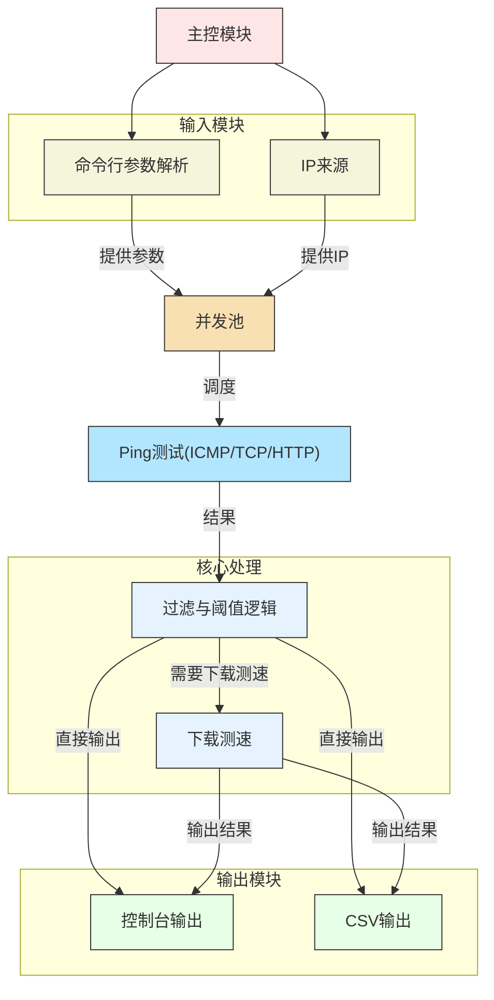

```mermaid
flowchart TB
    %% 样式定义
    classDef input fill:#f5f5dc,stroke:#333,stroke-width:1px;
    classDef processing fill:#e6f3ff,stroke:#333,stroke-width:1px;
    classDef infra fill:#f9e0b2,stroke:#333,stroke-width:1px;
    classDef output fill:#e6ffe6,stroke:#333,stroke-width:1px;
    classDef orchestration fill:#ffe6e6,stroke:#333,stroke-width:1px;
    classDef ping fill:#b2e6ff,stroke:#333,stroke-width:1px;

    %% 主控模块
    Main["主控模块"]:::orchestration

    %% 输入模块
    subgraph 输入模块["输入模块"]
        CLI["命令行参数解析"]:::input
        IP["IP来源"]:::input
    end

    %% 并发池
    Pool["并发池"]:::infra

    %% Ping测试
    Ping["Ping测试(ICMP/TCP/HTTP)"]:::ping

    %% 核心处理
    subgraph 核心处理["核心处理"]
        Filter["过滤与阈值逻辑"]:::processing
        Download["下载测速"]:::processing
    end

    %% 输出模块
    subgraph 输出模块["输出模块"]
        Console["控制台输出"]:::output
        CSV["CSV输出"]:::output
    end

    %% 连线优化
    Main --> CLI
    Main --> IP
    CLI -->|提供参数| Pool
    IP -->|提供IP| Pool
    Pool -->|调度| Ping
    Ping -->|结果| Filter
    Filter -->|需要下载测速| Download
    Filter -->|直接输出| Console
    Filter -->|直接输出| CSV
    Download -->|输出结果| Console
    Download -->|输出结果| CSV

    %% 超链接
    click Main "https://github.com/guangyu-yu/cloudflarest-rust/blob/main/src/main.rs"
    click CLI "https://github.com/guangyu-yu/cloudflarest-rust/blob/main/src/args.rs"
    click IP "https://github.com/guangyu-yu/cloudflarest-rust/blob/main/src/ip.rs"
    click Pool "https://github.com/guangyu-yu/cloudflarest-rust/blob/main/src/pool.rs"
    click Ping "https://github.com/guangyu-yu/cloudflarest-rust/blob/main/src/" _parent
    click Download "https://github.com/guangyu-yu/cloudflarest-rust/blob/main/src/download.rs"
    click CSV "https://github.com/guangyu-yu/cloudflarest-rust/blob/main/src/csv.rs"
```
