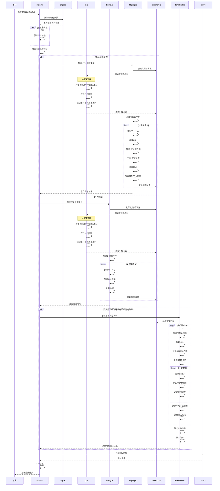

```mermaid
sequenceDiagram
    participant User as 用户
    participant Main as main.rs
    participant Args as args.rs
    participant IP as ip.rs
    participant TCPing as tcping.rs
    participant HTTPing as httping.rs
    participant Common as common.rs
    participant Download as download.rs
    participant CSV as csv.rs
    
    User->>Main: 启动程序并提供参数
    Main->>Args: 解析命令行参数
    Args-->>Main: 返回解析后的参数
    
    alt 设置全局超时
        Main->>Main: 创建超时线程
    end
    
    Main->>Main: 初始化随机数种子
    
    alt 选择测速模式
        Main->>HTTPing: 创建HTTP测速实例
        HTTPing->>Common: 初始化测试环境
        Common->>IP: 加载IP到缓冲区
        
        note over IP: IP处理流程
        IP->>IP: 收集IP源(文件/文本/URL)
        IP->>IP: 计算总IP数量
        IP->>IP: 启动生产者线程生成IP
        IP-->>Common: 返回IP缓冲区
        
        HTTPing->>HTTPing: 创建处理器工厂
        
        loop 处理每个IP
            HTTPing->>HTTPing: 获取下一个IP
            HTTPing->>HTTPing: 构建URL
            HTTPing->>HTTPing: 创建HTTP客户端
            HTTPing->>HTTPing: 发送HTTP请求
            HTTPing->>HTTPing: 计算延迟
            HTTPing->>HTTPing: 提取数据中心信息
            HTTPing->>Common: 更新测试结果
        end
        
        HTTPing-->>Main: 返回测速结果
    else TCP测速
        Main->>TCPing: 创建TCP测速实例
        TCPing->>Common: 初始化测试环境
        Common->>IP: 加载IP到缓冲区
        
        note over IP: IP处理流程
        IP->>IP: 收集IP源(文件/文本/URL)
        IP->>IP: 计算总IP数量
        IP->>IP: 启动生产者线程生成IP
        IP-->>Common: 返回IP缓冲区
        
        TCPing->>TCPing: 创建处理器工厂
        
        loop 处理每个IP
            TCPing->>TCPing: 获取下一个IP
            TCPing->>TCPing: 创建TCP连接
            TCPing->>TCPing: 计算延迟
            TCPing->>Common: 更新测试结果
        end
        
        TCPing-->>Main: 返回测速结果
    end
    
    alt 不禁用下载测速且有延迟测速结果
        Main->>Download: 创建下载测速实例
        Download->>Common: 获取URL列表
        
        loop 处理每个IP
            Download->>Download: 创建下载处理器
            Download->>Download: 构建URL
            Download->>Download: 创建HTTP客户端
            Download->>Download: 发送HTTP请求
            
            loop 下载数据
                Download->>Download: 读取数据块
                Download->>Download: 更新接收数据量
                Download->>Download: 计算实时速度
            end
            
            Download->>Download: 计算平均下载速度
            Download->>Download: 更新测试结果
        end
        
        Download->>Download: 筛选合格结果
        Download->>Download: 排序结果
        Download-->>Main: 返回下载测速结果
    end
    
    Main->>CSV: 导出CSV结果
    CSV-->>Main: 完成导出
    Main->>Main: 打印结果
    Main-->>User: 显示最终结果
```
