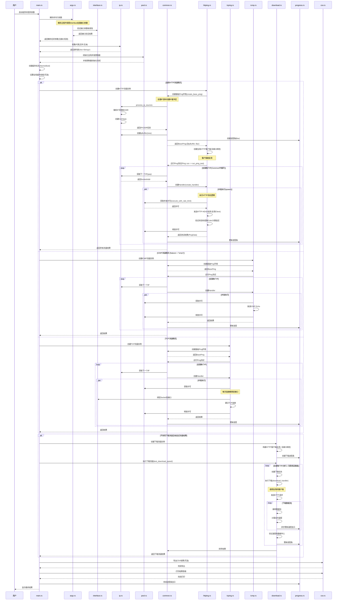

```mermaid
sequenceDiagram
    participant User as 用户
    participant Main as main.rs
    participant Args as args.rs
    participant Interface as interface.rs
    participant IP as ip.rs
    participant Pool as pool.rs
    participant Common as common.rs
    participant HTTPing as httping.rs
    participant TCPing as tcping.rs
    participant ICMP as icmp.rs
    participant Download as download.rs
    participant Progress as progress.rs
    participant CSV as csv.rs

    User->>Main: 启动程序并提供参数
    Main->>Args: 解析命令行参数
    note over Args: 解析过程中调用Interface处理接口参数
    Args->>Interface: 验证接口参数有效性
    Interface-->>Args: 返回接口验证结果
    Args-->>Main: 返回解析后的参数(含接口信息)

    Main->>IP: 收集IP源(文件/文本)
    IP-->>Main: 返回源列表(Vec<String>)

    Main->>Pool: 初始化全局并发限制器
    Pool-->>Main: 并发限制器初始化完成

    Main->>Main: 创建超时标志(AtomicBool)
    Main->>Main: 设置全局超时线程(可选)

    alt 选择HTTP测速模式
        Main->>HTTPing: 创建HTTP测速实例
        HTTPing->>Common: 创建基础Ping环境(create_base_ping)
        
        note over Common: 处理IP源并创建IP缓冲区
        Common->>IP: process_ip_sources
        IP->>IP: 解析IP范围和CIDR
        IP->>IP: 创建CidrState
        IP-->>Common: 返回IP/CIDR信息
        Common->>IP: 创建IpBuffer(new)
        Common->>Progress: 创建进度条(Bar)
        Common-->>HTTPing: 返回BasePing(含IpBuffer, Bar)

        HTTPing->>HTTPing: 创建全局HTTP客户端(含接口绑定)
        note over HTTPing: 客户端被复用

        HTTPing->>Common: 运行Ping测试(Ping::run -> run_ping_test)
        
        loop 处理每个IP(Common中循环)
             Common->>IP: 获取下一个IP(pop)
             IP-->>Common: 返回SocketAddr
             
             Common->>HTTPing: 创建Handler(create_handler)
             
             par 并发执行(spawn)
                 note over HTTPing: 执行HTTP测试逻辑
                 HTTPing->>Pool: 获取并发许可(execute_with_rate_limit)
                 Pool-->>HTTPing: 返回许可
                 
                 HTTPing->>HTTPing: 发送HTTP HEAD请求(复用Client)
                 HTTPing->>HTTPing: 验证状态码/提取Colo/计算延迟
                 
                 HTTPing->>Pool: 释放许可
                 
                 HTTPing-->>Common: 返回测试结果(PingData)
                 Common->>Progress: 更新进度条
             end
        end
        
        Common-->>Main: 返回所有测速结果
        
    else ICMP测速模式 (feature = "icmp")
        Main->>ICMP: 创建ICMP测速实例
        ICMP->>Common: 创建基础Ping环境
        Common-->>ICMP: 返回BasePing
        
        ICMP->>Common: 运行Ping测试
        loop 处理每个IP
             Common->>IP: 获取下一个IP
             Common->>ICMP: 创建Handler
             par 并发执行
                 ICMP->>Pool: 获取许可
                 ICMP->>ICMP: 发送ICMP Echo
                 ICMP->>Pool: 释放许可
                 ICMP-->>Common: 返回结果
                 Common->>Progress: 更新进度
             end
        end
        Common-->>Main: 返回结果

    else TCP测速模式
        Main->>TCPing: 创建TCP测速实例
        TCPing->>Common: 创建基础Ping环境
        Common-->>TCPing: 返回BasePing
        
        TCPing->>Common: 运行Ping测试
        loop 处理每个IP
             Common->>IP: 获取下一个IP
             Common->>TCPing: 创建Handler
             par 并发执行
                 TCPing->>Pool: 获取许可
                 
                 note over TCPing: 每次连接都绑定接口
                 TCPing->>Interface: 绑定Socket到接口
                 TCPing->>TCPing: 建立TCP连接
                 
                 TCPing->>Pool: 释放许可
                 TCPing-->>Common: 返回结果
                 Common->>Progress: 更新进度
             end
        end
        Common-->>Main: 返回结果
    end

    alt 不禁用下载测速且有延迟测速结果
        Main->>Download: 创建下载测速实例
        Download->>Download: 构建HTTP客户端(复用, 含接口绑定)
        Download->>Progress: 创建下载进度条
        
        Main->>Download: 执行下载测速(test_download_speed)
        
        loop 处理每个IP(串行, 只要满足数量)
            Download->>Download: 创建下载任务
            Download->>Download: 执行下载(download_handler)
            
            note over Download: 使用复用的客户端
            Download->>Download: 发送HTTP请求
            
            loop 下载数据流
                Download->>Download: 接收数据块
                Download->>Download: 计算实时速度
                Download->>Progress: 异步更新速度显示
            end
            
            Download->>Download: 验证速度和数据中心
            Download->>Progress: 更新进度条
        end
        
        Download->>Common: 排序结果
        Download-->>Main: 返回下载测速结果
    end

    Main->>CSV: 导出CSV结果(可选)
    CSV-->>Main: 完成导出
    
    Main->>CSV: 打印结果表格
    CSV-->>Main: 完成打印
    
    Main->>Progress: 完成进度条显示
    Main-->>User: 显示最终结果
```
