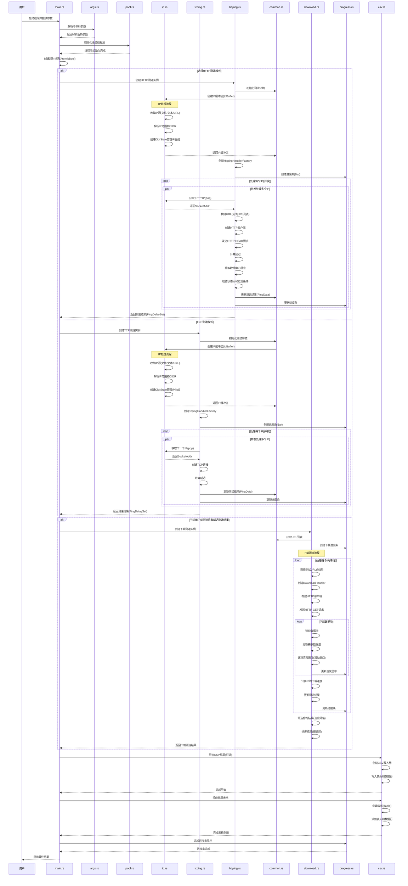

```mermaid
sequenceDiagram
    participant User as 用户
    participant Main as main.rs
    participant Args as args.rs
    participant Pool as pool.rs
    participant IP as ip.rs
    participant TCPing as tcping.rs
    participant HTTPing as httping.rs
    participant Common as common.rs
    participant Download as download.rs
    participant Progress as progress.rs
    participant CSV as csv.rs
    
    User->>Main: 启动程序并提供参数
    Main->>Args: 解析命令行参数
    Args-->>Main: 返回解析后的参数
    
    Main->>Pool: 初始化全局线程池
    Pool-->>Main: 线程池初始化完成
    
    Main->>Main: 创建超时标志(AtomicBool)
    
    alt 选择HTTP测速模式
        Main->>HTTPing: 创建HTTP测速实例
        HTTPing->>Common: 初始化测试环境
        Common->>IP: 创建IP缓冲区(IpBuffer)
        
        note over IP: IP处理流程
        IP->>IP: 收集IP源(文件/文本/URL)
        IP->>IP: 解析IP范围和CIDR
        IP->>IP: 创建CidrState管理IP生成
        IP-->>Common: 返回IP缓冲区
        
        HTTPing->>HTTPing: 创建HttpingHandlerFactory
        HTTPing->>Progress: 创建进度条(Bar)
        
        loop 处理每个IP(并发)
            par 并发处理多个IP
                HTTPing->>IP: 获取下一个IP(pop)
                IP-->>HTTPing: 返回SocketAddr
                
                HTTPing->>HTTPing: 构建URL(轮询URL列表)
                HTTPing->>HTTPing: 创建HTTP客户端
                HTTPing->>HTTPing: 发送HTTP HEAD请求
                HTTPing->>HTTPing: 计算延迟
                HTTPing->>HTTPing: 提取数据中心信息
                HTTPing->>HTTPing: 检查状态码和过滤条件
                HTTPing->>Common: 更新测试结果(PingData)
                HTTPing->>Progress: 更新进度条
            end
        end
        
        HTTPing-->>Main: 返回测速结果(PingDelaySet)
    else TCP测速模式
        Main->>TCPing: 创建TCP测速实例
        TCPing->>Common: 初始化测试环境
        Common->>IP: 创建IP缓冲区(IpBuffer)
        
        note over IP: IP处理流程
        IP->>IP: 收集IP源(文件/文本/URL)
        IP->>IP: 解析IP范围和CIDR
        IP->>IP: 创建CidrState管理IP生成
        IP-->>Common: 返回IP缓冲区
        
        TCPing->>TCPing: 创建TcpingHandlerFactory
        TCPing->>Progress: 创建进度条(Bar)
        
        loop 处理每个IP(并发)
            par 并发处理多个IP
                TCPing->>IP: 获取下一个IP(pop)
                IP-->>TCPing: 返回SocketAddr
                
                TCPing->>TCPing: 创建TCP连接
                TCPing->>TCPing: 计算延迟
                TCPing->>Common: 更新测试结果(PingData)
                TCPing->>Progress: 更新进度条
            end
        end
        
        TCPing-->>Main: 返回测速结果(PingDelaySet)
    end
    
    alt 不禁用下载测速且有延迟测速结果
        Main->>Download: 创建下载测速实例
        Download->>Common: 获取URL列表
        Download->>Progress: 创建下载进度条
        
        note over Download: 下载测速流程
        loop 处理每个IP(串行)
            Download->>Download: 选择测试URL(轮询)
            Download->>Download: 创建DownloadHandler
            Download->>Download: 构建HTTP客户端
            Download->>Download: 发送HTTP GET请求
            
            loop 下载数据块
                Download->>Download: 读取数据块
                Download->>Download: 更新接收数据量
                Download->>Download: 计算实时速度(滑动窗口)
                Download->>Progress: 更新速度显示
            end
            
            Download->>Download: 计算平均下载速度
            Download->>Download: 更新测试结果
            Download->>Progress: 更新进度条
        end
        
        Download->>Download: 筛选合格结果(速度阈值)
        Download->>Download: 排序结果(按延迟)
        Download-->>Main: 返回下载测速结果
    end
    
    Main->>CSV: 导出CSV结果(可选)
    CSV->>CSV: 创建CSV写入器
    CSV->>CSV: 写入表头和数据行
    CSV-->>Main: 完成导出
    
    Main->>CSV: 打印结果表格
    CSV->>CSV: 创建表格(Table)
    CSV->>CSV: 添加表头和数据行
    CSV-->>Main: 完成表格创建
    
    Main->>Progress: 完成进度条显示
    Progress-->>Main: 进度条完成
    Main-->>User: 显示最终结果
```
